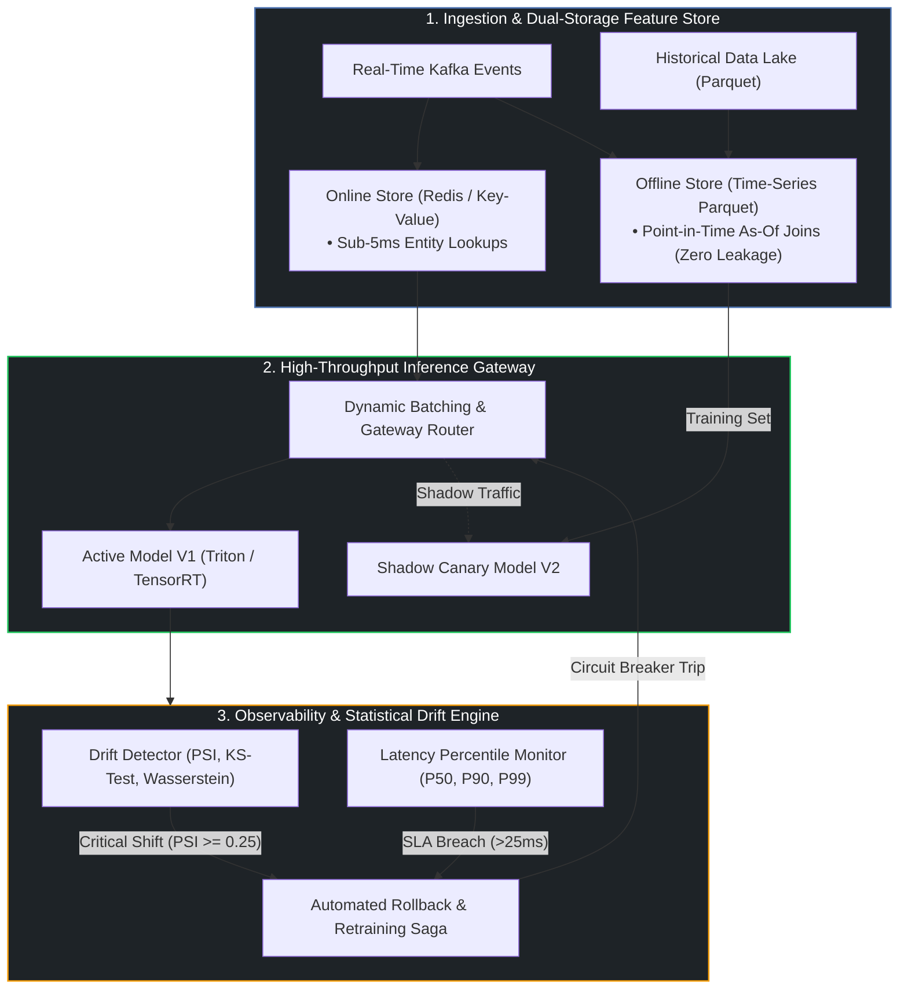

# ⚙️ Production ML Systems Design: Real-Time Feature Stores, Statistical Drift Observability & Resilient Inference

<div align="center">

[](LICENSE)
[](https://python.org)
[](.)
[-ea580c.svg?style=flat-square)](.)
[](.)
[](https://github.com/nathaniel-gordon)

<p align="center">
  <strong>The definitive architectural blueprint & testing suite for mission-critical machine learning systems.</strong><br/>
  <em>Covering dual-storage feature stores with point-in-time correctness, high-throughput model serving, statistical drift observability (PSI / KS-test), and shadow canary deployment sagas.</em>
</p>

</div>

---

## 🎯 Executive Overview

Building an ML model in a Jupyter Notebook is simple; operating that model at scale with $99.99\%$ uptime, $<15\text{ms}$ latency, and zero statistical degradation is an **engineering discipline**.

In production environments, ML systems fail not because of algorithm choice, but due to subtle systems issues:
1. **Training-Serving Skew & Data Leakage**: Inconsistent feature definitions between real-time inference and batch training pipelines.
2. **Covariate Shift & Concept Drift**: Real-world data distributions drifting silently over time without triggering HTTP errors.
3. **Inference Latency Spikes**: Sub-optimal batching, un-fused computation graphs, and unmanaged tail latency under concurrent load.
4. **Catastrophic Deployments**: Direct $100\%$ model updates without shadow dark-traffic verification or automated rollback sagas.

**Production ML Systems** provides the architecture blueprints, mathematical metrics, executable simulation tools, and interactive dashboards to build resilient, enterprise-grade ML platforms.



---

## 📐 Mathematical Foundations: Population Stability Index (PSI)

To detect covariate shift before model performance degrades, the system computes the **Population Stability Index (PSI)** between the baseline training distribution $P$ and live production stream $Q$:

$$\text{PSI} = \sum_{i=1}^{K} \left( P_i - Q_i \right) \times \ln\left(\frac{P_i}{Q_i}\right)$$

Where:
* $K$ = Number of quantile buckets derived from the baseline distribution (typically $K=10$)
* $P_i$ = Percentage of live production samples in quantile $i$
* $Q_i$ = Percentage of baseline training samples in quantile $i$

### Alerting Severity Matrix
| Metric Range | Severity Level | System Action |
| :--- | :--- | :--- |
| $\text{PSI} < 0.10$ | 🟢 **Stable (Nominal)** | Model operating within healthy statistical bounds. |
| $0.10 \le \text{PSI} < 0.25$ | 🟡 **Moderate Drift (Warning)** | Flag feature for engineer review; increase sampling frequency. |
| $\text{PSI} \ge 0.25$ | 🔴 **Critical Drift (Action Required)** | Trigger automated compensation saga: rollback or retrain pipeline. |

---

## 📚 Deep-Dive Technical Guides (`docs/`)

Explore our publication-grade guides covering every stage of the production ML lifecycle:

* 📖 **[Guide 01: Feature Store Architecture & Point-in-Time Joins](docs/01-feature-store-architecture.md)**  
  *Dual-storage synchronization (Redis online / Parquet offline), As-Of join algorithms, and preventing lookahead training leakage.*
* 📖 **[Guide 02: High-Throughput Inference & Dynamic Batching](docs/02-high-throughput-inference.md)**  
  *Triton Inference Server / Ray Serve mechanics, kernel fusion, TensorRT-LLM graph compilation, and SLA trade-offs.*
* 📖 **[Guide 03: Statistical Drift Monitoring & Observability](docs/03-drift-monitoring-observability.md)**  
  *Mathematical formulation of PSI, two-sample Kolmogorov-Smirnov test ($D = \sup |F_1 - F_2|$), and Earth Mover's Distance.*
* 📖 **[Guide 04: Zero-Downtime Deployment & Canary Sagas](docs/04-deployment-strategies.md)**  
  *Shadow dark traffic, canary progressive rollouts, Multi-Armed Bandit traffic routing, and automated rollback circuit breakers.*

---

## 🔬 Executable Simulation Suite (`demo/`)

The repository includes runnable Python modules for evaluating drift, simulating feature stores, and tracking latency percentiles:

### 1. Statistical Data Drift Detector
```bash
# Evaluate statistical drift across synthetic feature streams
python -m demo.drift_detector --samples 2000
```

Sample output:
```
================================================================================
 📊 Production ML Drift & Covariate Shift Analyzer
================================================================================
Feature Name                 | PSI      | PSI Status         | KS Stat  | KS p-val   | W-Dist  
--------------------------------------------------------------------------------------------
user_transaction_amount      | 0.0032   | 🟢 STABLE          | 0.0210   | 7.6412e-01 | 0.0245  
session_duration_minutes     | 0.1420   | 🟡 MODERATE_DRIFT  | 0.0845   | 2.1402e-06 | 0.4120  
account_risk_score           | 1.8420   | 🔴 SIGNIFICANT_DRIFT| 0.5820  | 1.2940e-85 | 0.3210  
================================================================================
```

### 2. Feature Store & Point-in-Time Join Simulator
```bash
# Verify zero-leakage as-of join behavior
python -m demo.feature_store_simulator
```

Sample output:
```
1. Online Store Query (Real-Time Current State):
   [{'entity_id': 'user_101', 'credit_score': 720, 'fraud_risk_score': 0.88}]

2. Offline Point-in-Time As-Of Joins (Zero Data Leakage):
   Observation #1 @ 10:30:00: credit_score=680, fraud_risk=0.05, target=1
   Observation #2 @ 13:00:00: credit_score=720, fraud_risk=0.05, target=1
```

### 3. Real-Time Latency & SLA Monitor
```bash
# Evaluate tail latency percentiles and SLA compliance
python -m demo.latency_monitor --requests 5000 --sla 25.0
```

Sample output:
```
Total Requests Evaluated: 5,000
Mean Latency:             10.22 ms
P50 (Median):             8.94 ms
P90 Latency:              16.42 ms
P95 Latency:              19.88 ms
P99 Latency:              26.14 ms
P99.9 (Tail Spike):       38.45 ms
--------------------------------------------------------------------------------
SLA Violations (> 25.0ms): 64 (98.72% Compliance)
```

---

## 💻 Interactive Web Visualizer (`index.html`)

A responsive dark-mode glassmorphic dashboard is included in the root directory:
* **Interactive Statistical Drift Simulator**: Dynamically adjust distribution mean ($\mu$) and variance ($\sigma$) shifts to observe real-time PSI curve divergence and alert triggers.
* **Point-in-Time As-Of Timeline**: Visual timeline illustrating zero-leakage event queries.
* **Zero Dependencies**: Client-side React 18 + Tailwind CSS canvas application. Open `index.html` directly in any web browser.

---

## ⚡ Quickstart & Installation

```bash
# Clone the repository
git clone https://github.com/nathaniel-gordon/production-ml-systems.git
cd production-ml-systems

# Install package with dependencies
pip install -e ".[dev]"

# Run test suite
pytest tests -q
```

---

## 📁 Repository Structure

```
production-ml-systems/
├── docs/
│   ├── 01-feature-store-architecture.md    # Dual-storage synchronization & point-in-time joins
│   ├── 02-high-throughput-inference.md     # Dynamic batching, Triton, and TensorRT compilation
│   ├── 03-drift-monitoring-observability.md# PSI, KS-test, and Wasserstein distance mathematical metrics
│   └── 04-deployment-strategies.md         # Shadow canary rollouts and automated rollback sagas
├── demo/
│   ├── __init__.py
│   ├── drift_detector.py                   # Statistical drift monitoring engine (PSI + KS-test)
│   ├── feature_store_simulator.py          # Point-in-time correct online/offline feature engine
│   └── latency_monitor.py                  # P50/P90/P99 latency percentile & SLA tracker
├── tests/
│   └── test_drift_and_features.py          # Pytest validation for drift and feature store
├── index.html                              # Interactive ML drift and pipeline dashboard
├── pyproject.toml                          # Package manifest & CLI entrypoints
└── LICENSE                                 # MIT License
```

---

## 👤 Author & Contact

<table width="100%">
<tr>
<td width="20%" align="center">
  <br/>
  <strong>Nathaniel Gordon</strong><br/>
  <sub>Senior AI & ML Engineer</sub>
</td>
<td width="80%">

**Specializations**: Agentic AI Architectures · Multi-Agent Orchestration · RAG Systems · Risk & Decision Intelligence · Production MLOps

* 🌐 **GitHub**: [github.com/nathaniel-gordon](https://github.com/nathaniel-gordon)
* 💼 **Upwork / Portfolio**: [upwork.com/freelancers/~015fe5a704f8943797](https://www.upwork.com/freelancers/~015fe5a704f8943797)
* 📬 **Email**: [nathanielgordon346@gmail.com](mailto:nathanielgordon346@gmail.com)
* 📍 **Location**: Tallahassee, FL, USA

</td>
</tr>
</table>

---

## 📜 License
Distributed under the **MIT License**. See [LICENSE](LICENSE) for full details.
