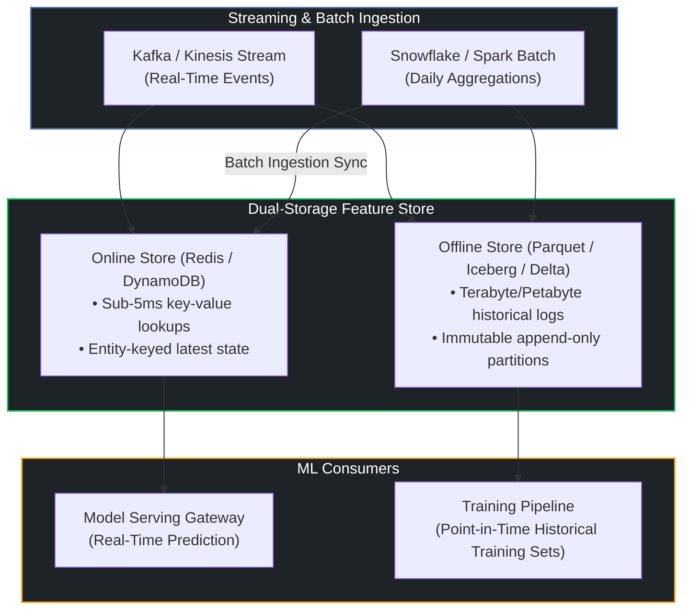
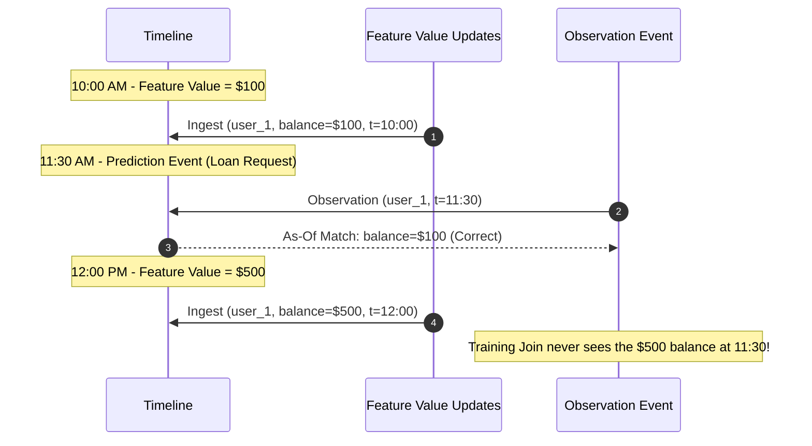

# 🏪 Guide 01: Dual-Storage Feature Store Architecture & Point-in-Time Joins

## 1. The Online/Offline Dual-Storage Paradigm

In production ML systems, features are consumed in two fundamentally different environments with competing operational requirements:

---

## 2. Preventing Data Leakage via Point-in-Time (As-Of) Joins

The most common cause of ML models failing in production after reporting stellar offline validation scores is **Data Leakage (Lookahead Bias)**:
* Training a fraud model using a customer's `chargeback_count_30d` computed *after* the fraudulent event occurred.

### The Point-in-Time Join Algorithm
For each observation event $E_j = (\text{entity\_id}_j, t_j)$ with observation timestamp $t_j$, the feature store extracts the most recent feature record $F_{i}$ satisfying:

$$\text{timestamp}(F_i) \le t_j$$

