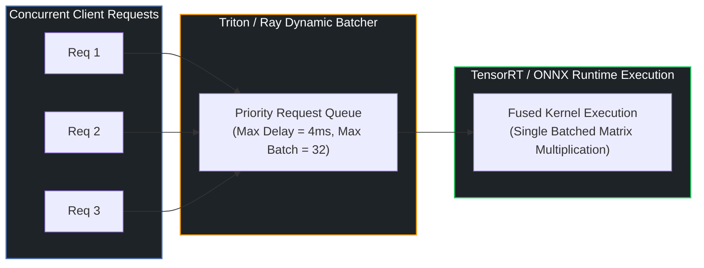

# ⚡ Guide 02: High-Throughput Model Serving & Dynamic Batching

## 1. The Serving Latency vs. Throughput Trade-off

When deploying models in real-time microservices, individual incoming requests arrive concurrently at random intervals. Processing requests individually ($B=1$) results in low GPU compute utilization ($<15\%$) and high cost. Conversely, large static batches introduce excessive queue waiting latency.

**Dynamic Batching** dynamically coalesces incoming client requests over a sliding time window $\Delta t$ (e.g. $5\text{ms}$):
* If the batch reaches `max_batch_size` (e.g. 32), dispatch immediately.
* If `max_queue_delay_microseconds` expires, dispatch whatever requests are currently queued.

---

## 2. Kernel Fusion & Graph Compilation (TensorRT / ONNX Runtime)

PyTorch models execute operations as separate discrete GPU kernels, incurring memory bandwidth round-trips to global HBM memory:
* `LayerNorm` $\rightarrow$ Write HBM $\rightarrow$ Read HBM $\rightarrow$ `GELU` $\rightarrow$ Write HBM $\rightarrow$ Read HBM $\rightarrow$ `Linear`.

**Graph Compilers (TensorRT / torch.compile)** fuse adjacent operations into single compound GPU kernels, executing directly inside fast on-chip SRAM cache ($L1$/Shared Memory), reducing inference latency by **$2\times$ to $4\times$**.
