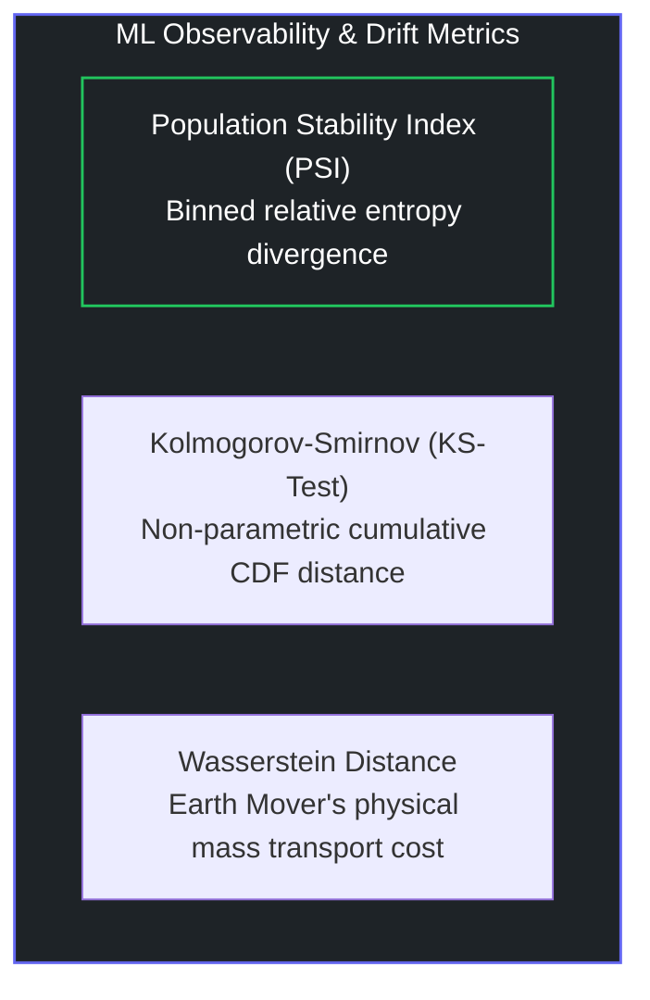

# 📊 Guide 03: Statistical Drift Monitoring & Covariate Shift Observability

## 1. Types of Drift in Production ML

1. **Covariate Shift (Data Drift)**: Distribution of input features $P(X)$ changes over time, while conditional relationship $P(Y|X)$ remains constant.
   * *Example*: User demographics shift during a marketing campaign.
2. **Concept Drift**: The underlying relationship between features and target labels $P(Y|X)$ changes.
   * *Example*: Consumer buying habits change during macroeconomic inflation.
3. **Prior Probability Shift**: The base rate of target labels $P(Y)$ changes.

---

## 2. The Population Stability Index (PSI) Formula

$$\text{PSI} = \sum_{i=1}^{K} \left( P_i - Q_i \right) \times \ln\left(\frac{P_i}{Q_i}\right)$$

Where:
* $K$ = Number of distribution buckets (typically 10 quantiles derived from training data)
* $P_i$ = Percentage of production observations in bucket $i$
* $Q_i$ = Percentage of baseline reference/training observations in bucket $i$

### Alerting Severity Matrix:
* **$\text{PSI} < 0.10$ (Green / Stable)**: No significant change; model operating within expected boundaries.
* **$0.10 \le \text{PSI} < 0.25$ (Yellow / Moderate Drift)**: Noticeable distribution shift; flag for engineer review.
* **$\text{PSI} \ge 0.25$ (Red / Critical Drift)**: Significant distribution divergence; trigger automated retraining saga or fallback model.
