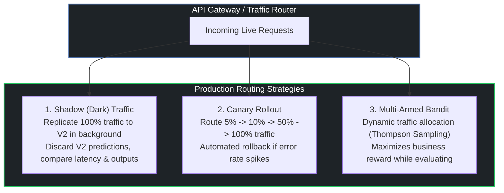

# 🚀 Guide 04: Zero-Downtime Deployment Strategies & Canary Sagas

## 1. Safe Deployment Patterns for Machine Learning

Deploying new model versions ($V_{new}$) directly into 100% production traffic introduces immense risk. Production ML pipelines use safe progressive rollout patterns:

---

## 2. Automated Rollback Compensation Sagas

If the production monitoring system detects an anomaly (P99 latency $>50\text{ms}$, error rate $>0.5\%$, or critical PSI drift $>0.25$), an automated compensation saga triggers:
1. **Circuit Breaker Trip**: Immediately redirect 100% of traffic back to stable baseline Model $V_1$.
2. **Snapshot Anomaly**: Log offending request/response payloads to quarantine storage.
3. **Trigger Retraining Alert**: Page on-call ML engineers with statistical drift diagnostics.
